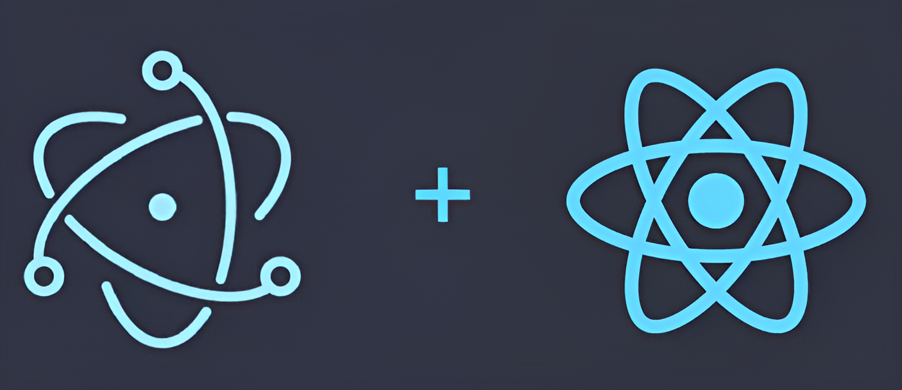

## Electron + React Application Boilerplate



Made for <strong>highly scalable</strong>, <strong>performant</strong> and <strong>easily maintainable</strong> Electron and React desktop applications.

---

## Installation

### ⚠️ Prerequisites

- [Node.js](https://nodejs.org/)
- [Yarn](https://yarnpkg.com/) (optional, but recommended)

### Clone the Repository

```bash
git clone https://github.com/soualahmohammedzakaria/Electron-React-App-Boilerplate.git
cd Electron-React-App-Boilerplate
```

### Install Dependencies

```
yarn install
# or
npm install
```

## Actions

### Start the application

```
yarn electron:start
# or
npm run electron:start
```

### Package the application
```
yarn electron:package:PLATFORM
# or
npm run electron:package:PLATFORM
# where PLATFORM can be mac, win or linux.
```

## Contributing

Contributions are welcome! Please fork the repository and submit a pull request with your changes. Ensure your code follows the project's coding standards and includes appropriate tests.

## License

This project is licensed under the MIT License. See the [LICENSE](LICENSE) file for details.